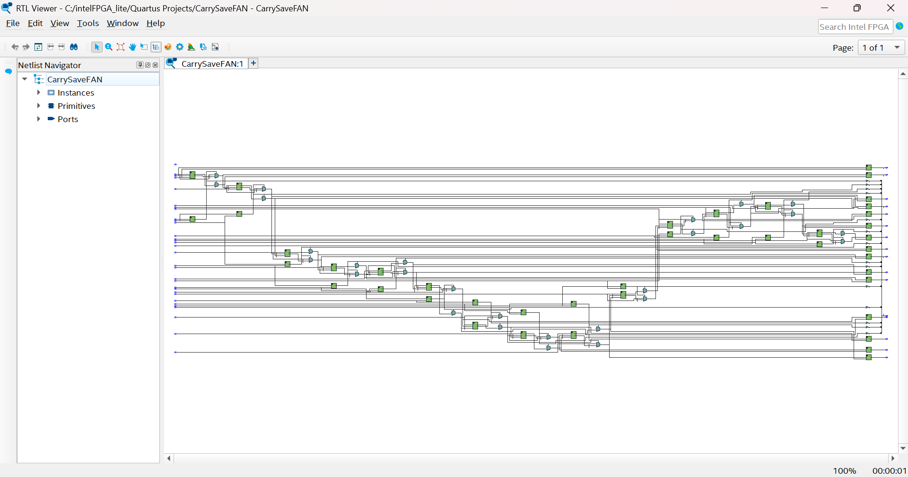

# Altera Quartus Prime Lite 23.1 Std. Synthesis

Board - Cyclone IV E: EP4CE115F2918L

## Combinational

Parameters: N = 16, W = 8, V = 3
Max Path Delay: 10ns

| Design | Slow 100C Setup Slack | Slow -40C Setup Slack | Fast -40C Setup Slack | LUTs |
| --- | --- | --- | --- | --- |
| RedTree | -7.531 | -6.609 | -0.120 | 433 |
| RedTreeFAN |  |  |  |  |
| CarrySaveFAN | -15.243 | -14.037 | -4.39 | 863 |

